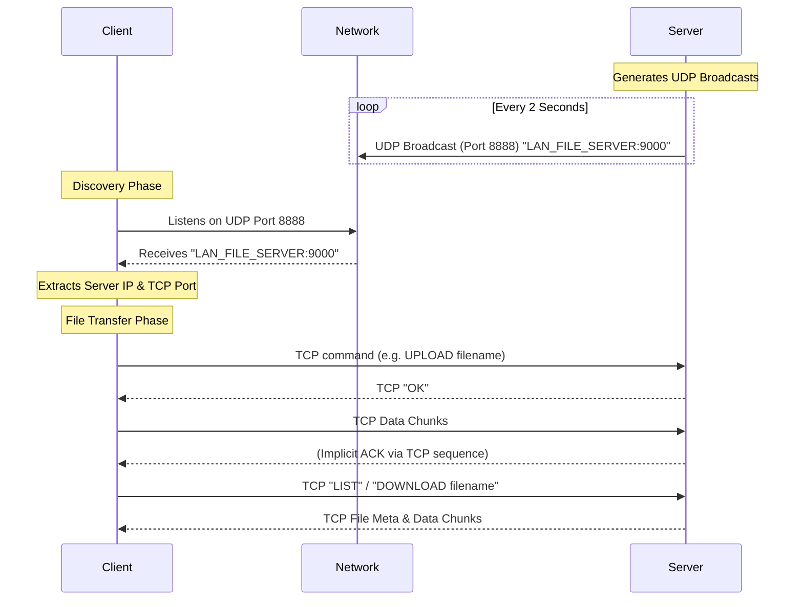

# Java LAN File Transfer System

A professional-grade, multi-threaded Java application that establishes a seamless File Transfer Protocol across a Local Area Network. This system is built entirely from scratch using the `java.net` standard library, eliminating the need for external frameworks or dependencies while fulfilling enterprise hardware transfer goals.

## Core Capabilities and Achievements

This project successfully proves the robust implementation of raw transmission protocols to facilitate multi-node decentralized device transfers. 

### 1. Zero-Configuration Subnet Discovery (UDP)
To eliminate the friction of manually tracking IP addresses across dynamic LANs, the system leverages a `DatagramSocket`. The host server autonomously broadcasts its presence every 2 seconds to the entire Wi-Fi subnet (Port `8888`), allowing any client node running the software to passively listen, extract the packet payload, and instantly identify the correct server IP and TCP port for subsequent connections.

### 2. Reliable Concurrent Communications (TCP)
Once discovered, devices establish stateful TCP connections over `ServerSocket`. Handling multiple concurrent connections from different machines is achieved through a centralized thread pool managed perfectly by Java's `ExecutorService`, avoiding thread-spawning overhead. The server safely synchronizes reads and writes using a shared `FileManager` instance ensuring zero data corruption. 

### 3. Memory-Safe Chunk Transmission
Both the client and the server have been meticulously designed to handle the uploading and downloading of massive files without blowing up the JVM Heap size memory constraints. The system achieves this by iterating over native File Input/Output Streams using strict `8KB` (`8192 byte`) memory buffers, wrapping the connections in `BufferedInputStream` and `BufferedOutputStream`s.

### 4. Cross-Platform Native Web Interface
While the project includes a fully featured Java command-line interface for terminal users, it also dynamically spins up an embedded HTTP Web Server built on `com.sun.net.httpserver.HttpServer`. The server serves a beautiful native HTML frontend on port `8080`, allowing an end-user on an iPhone, Android, or desktop to hit the File Server IP Address in their browser and immediately download shared files or drag-and-drop upload files via AJAX `application/octet-stream` directly into the Java Server filesystem.

## Networking Diagram

