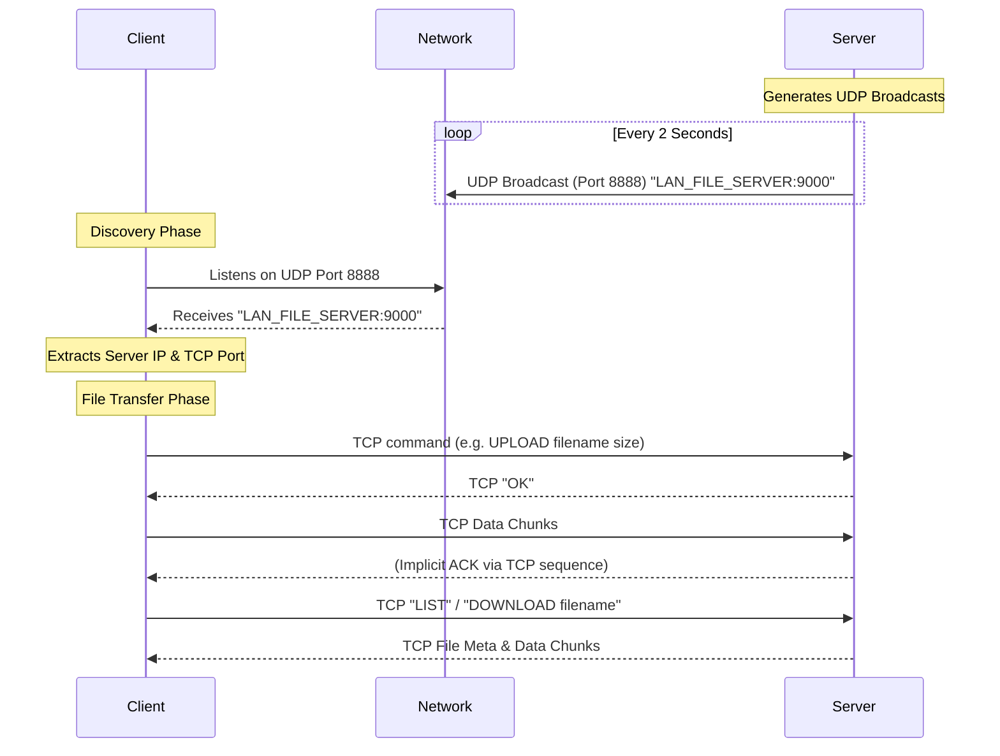

# Java LAN File Transfer System

A professional-grade Java application that allows users to upload, list, and download files across a Local Area Network. This system uses `java.net` without any external dependencies, featuring automatic robust server discovery using UDP broadcasting and reliable file transfers using TCP sockets.

## Architecture Explanation

The project follows a modular client-server architecture with a strict separation of concerns, fulfilling SOLID principles:

- **Server Application (`server.FileServer`)**:
  - Sets up a `java.util.concurrent.ExecutorService` fixed thread pool to handle multiple concurrent client TCP connections seamlessly.
  - Spawns a background thread running `UDPBroadcastService`, which periodically broadcasts `DatagramPacket` packets to the LAN subnet declaring its presence (`LAN_FILE_SERVER:<TCP_PORT>`).
  - Upon a client TCP connection, delegates the socket to a `ClientHandler` runnable.
  - Uses a singleton-like `FileManager` to ensure thread-safe concurrent reading and writing to the local `shared_files` directory.

- **Client Application (`client.FileClient`)**:
  - Initialized by running `ServerDiscoveryService`, which temporarily listens on the designated UDP broadcast port to automatically detect the `FileServer`'s IP address and TCP Port. No manual IP configuration is required.
  - Discovers the server and initializes an interactive command-line interface.
  - Delegates to `DownloadManager`, which orchestrates chunk-based bidirectional file transfers over TCP using `BufferedInputStream` and `BufferedOutputStream`. This guarantees bounded memory usage during the transmission of very large files.

## Networking Diagram



## Step-by-Step Execution Instructions

1. **Build the Project**
   Compile the `.java` files using the included build script:
   ```bash
   ./build.sh
   ```
   *This compiles all classes into the `bin/` directory.*

2. **Start the Server**
   Run the server in one terminal window. It will listen for incoming connections and start broadcasting its presence on the LAN:
   ```bash
   ./run-server.sh
   ```
   *The shared directory `shared_files/` will automatically be created in the directory where the server is executed.*

3. **Start the Client**
   Run the client in a separate terminal window (or on another computer connected to the same Wi-Fi/LAN subnet):
   ```bash
   ./run-client.sh
   ```
   *The client will automatically intercept the server's UDP broadcast, locate the server IP, and connect to its active TCP port.*

4. **Using the CLI**
   Once connected, use the interactive terminal commands:
   - `ls` - Lists files on the remote server
   - `upload <filepath>` - Uploads your local file (e.g., `upload test.txt`)
   - `download <filename>` - Downloads the file from the server into your `downloads/` directory
   - `exit` - Gracefully close the client application
